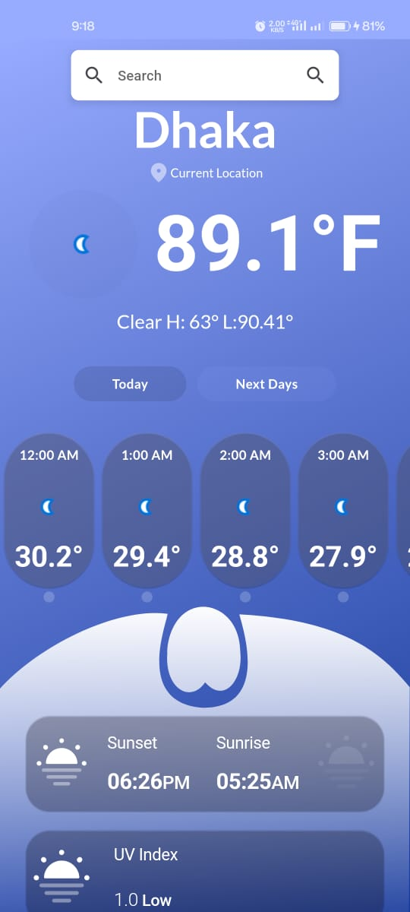
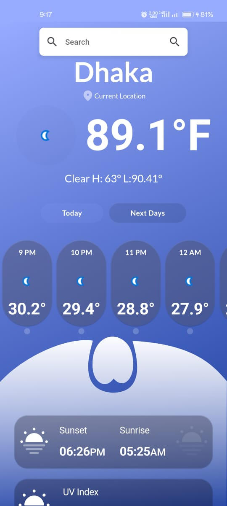
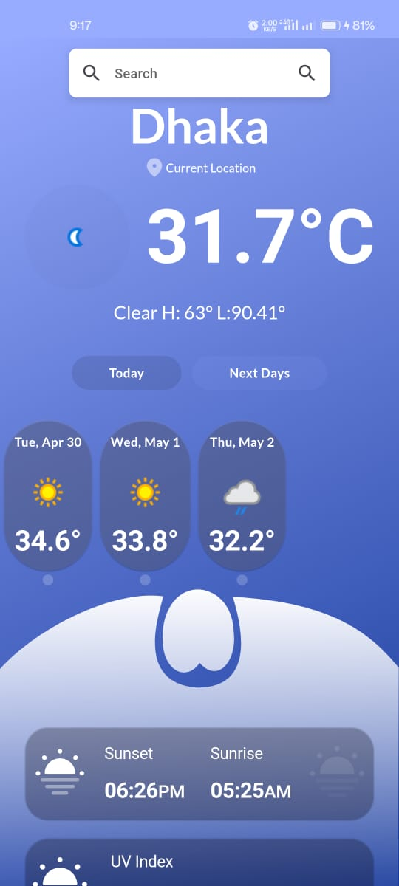

#  Weather App

 Weather is a Flutter application for checking weather information based on the user's location or a selected city.

## Overview

SF Weather provides users with current weather conditions, hourly forecasts, and other relevant weather information. The app uses the OpenWeatherMap API to fetch weather data and displays it in a user-friendly interface.

## Screenshots

  

## Features

- View current weather conditions, including temperature, humidity, wind speed, and UV index.
- Hourly forecasts for the current day and daily forecasts for the upcoming days.
- Option to view weather information based on the user's current location or a selected city.
- Beautiful UI with animations for an enhanced user experience.

## Getting Started

To run the SF Weather app locally, follow these steps:

1. Clone this repository to your local machine.
2. Switch to the `stateManagement-Provider` branch to use the version with state management implemented using Provider.
3. Open the project in Flutter and run `flutter pub get` to install dependencies.
4. Make sure you have an API key from OpenWeatherMap. If not, sign up and get your API key [here](https://www.weatherapi.com/).
5. Save the file and run the app on your preferred device or emulator.

## APK Download

[Download SF Weather APK](testing_apk/weather%20test.apk)
